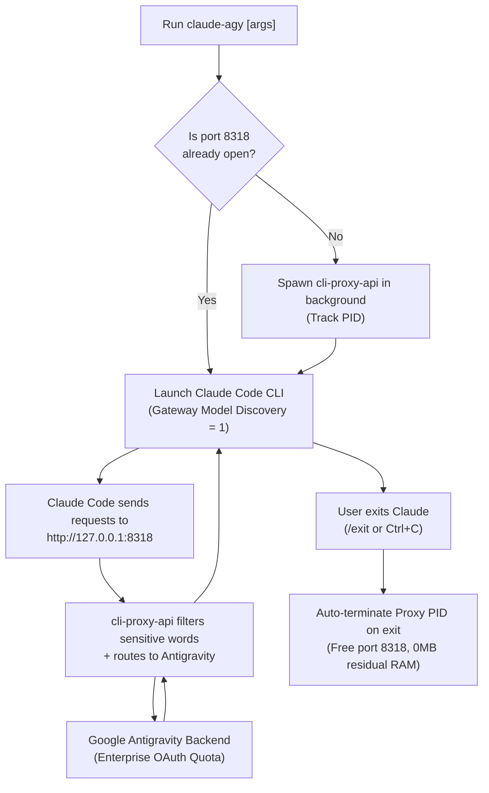

# Claude Code + Antigravity OAuth Integration (`claude-agy`)

This skill provides a complete automated guide, operations runbook, and architectural reference for running **Anthropic's Claude Code CLI** powered by **Google Antigravity OAuth** quotas instead of direct paid Anthropic API keys.

Designed for robust, zero-friction operation across developer workstations and headless server environments.

---

## 🏗️ Architecture & Execution Flow



---

## 💡 Design Philosophy: KISS & YAGNI

The system is designed strictly following **KISS** (Keep It Simple, Stupid) and **YAGNI** (You Aren't Gonna Need It) principles:
1. **Zero Redundant Aliases**: Instead of maintaining fragile static model alias tables, the system enables `CLAUDE_CODE_ENABLE_GATEWAY_MODEL_DISCOVERY="1"`.
2. **Dynamic Model Discovery (`/model`)**: Claude Code dynamically queries the upstream proxy (`GET /v1/models`). In the chat interface, engineers simply type `/model` to visually select between `claude-sonnet-4-6`, `claude-opus-4-6-thinking`, `gemini-3.8-flash-high`, and other models.
3. **Radical Minimalist Configuration**: The `config.yaml` file maintains only core settings: listening port, auth directory, and the `antigravity.sensitive-words` filter to completely prevent Google Cloud 429 quota exhaustion errors.

---

## 🚀 Installation

### 🌟 Universal Node.js Setup (Recommended)
Use the pure Node.js installer from the dedicated [`tuquet/claude-agy`](https://github.com/tuquet/claude-agy) repository:

```console
# Run one-line network installer
curl -fsSL https://raw.githubusercontent.com/tuquet/claude-agy/main/scripts/setup.mjs | node
```

*Universal Setup Highlights:*
- **100% Native Node.js**: Universal cross-platform compatibility without OS fragmentation.
- **Dynamic Multi-Source Token Resolver**: Automatically detects OAuth tokens from Antigravity CLI (`antigravity-cli`), Antigravity IDE (`jetski-standalone-oauth-token`), and OAuth credentials (`oauth_creds.json`).
- **Resilient Proxy & Gateway Support**: Auto-detects corporate firewalls and corporate web gateways.
- **Automated Launcher & PATH Configuration**: Generates launcher binaries and scripts and exposes them globally on system PATH.

---

### 📦 Package Manager (Scoop)
If Scoop is installed on your workstation:

```console
# 1. Add Tuquet Scoop Bucket
scoop bucket add tuquet https://github.com/tuquet/scoop-bucket

# 2. Install Claude-Agy
scoop install claude-agy
```
*Benefits:* Automatic dependency management (`nodejs-lts`), automatic shims, persistent tokens/config across version updates, and one-command upgrades via `scoop update claude-agy`.

---

### 💻 Local Source Installation
From a cloned or local repository:

```console
./install.sh
```

---

## 📁 Standard Application Directory Layout

The application is cleanly packaged and isolated:

```text
/root/claude-agy/
├── bin/
│   ├── claude-agy            # Universal CLI entrypoint & proxy lifecycle supervisor
│   └── cli-proxy-api         # Native reverse proxy binary
├── config/
│   ├── config.yaml           # Proxy routing configuration (KISS & YAGNI)
│   └── settings.env          # Environment settings (port, auto-bypass permission, default model)
├── data/
│   └── antigravity-auth.json # Synced OAuth credentials from Antigravity CLI
├── logs/                     # Runtime logs (ignored in VCS)
├── scripts/
│   ├── setup.mjs             # Universal Node.js installer
│   ├── sync-token.mjs        # Universal Node.js token scanner & synchronizer
│   └── uninstall.mjs         # Universal Node.js uninstaller
├── install.sh                # Standard local installer wrapper
├── uninstall.sh              # Standard local uninstaller wrapper
└── README.md
```

---

## ⚙️ Minimalist Configuration (`config/config.yaml`)

```yaml
host: "127.0.0.1"
port: 8318
auth-dir: "/root/claude-agy/data"
api-keys:
  - "sk-personal-claude-token"
remote-management:
  disable-control-panel: true
quota-exceeded:
  switch-project: true
  antigravity-credits: true
debug: false

# CRITICAL: Filter sensitive system words to prevent 429 RESOURCE_EXHAUSTED from Google backend
antigravity:
  sensitive-words:
    - "system-conventions"
    - "system_conventions"
    - "system-directive"
    - "system_directive"
    - "Claude Agent SDK"
    - "Claude Code"
    - "Anthropic"
    - "claude"
    - "API"
    - "proxy"
```

---

## 🛡️ Permission Bypass Techniques (Root & Unattended CI/CD)

### The Issue:
When running `--dangerously-skip-permissions` as `root`, Claude Code blocks execution:
```text
--dangerously-skip-permissions cannot be used with root/sudo privileges for security reasons
```

### Technical Solution:
1. **Environment Variable `IS_SANDBOX="1"`**:
   By analyzing Claude Code's bytecode:
   ```javascript
   isRootOutsideDeliberateSandbox() {
     return this.sources.platform !== "win32"
       && this.sources.getuid() === 0
       && !this.sources.isSandboxEnvSet()      // <-- process.env.IS_SANDBOX === "1"
       && !this.sources.isBubblewrapEnvSet();
   }
   ```
   When `IS_SANDBOX="1"`, Claude Code assumes execution occurs within an isolated container/sandbox and allows bypassing interactive confirmation.

2. **Automated Dialog Acceptance in `~/.claude.json`**:
   The installer pre-configures `~/.claude.json`:
   ```json
   {
     "bypassPermissionsModeAccepted": true,
     "hasCompletedOnboarding": true,
     "projects": {
       "<project-path>": { "hasTrustDialogAccepted": true }
     }
   }
   ```
   Enables 100% zero-touch execution, ideal for CI/CD automation and headless pipelines.

---

## ⚡ Cheatsheet & Command Reference

| Action | Inside Claude Code Chat | Or from Terminal |
| :--- | :--- | :--- |
| **List & select model** | `/model` (interactive picker) | `claude-agy --model <model-name>` |
| **Use default Sonnet** | `/model claude-sonnet-4-6` | `claude-agy` (Sonnet default) |
| **Use Opus Thinking** | `/model claude-opus-4-6-thinking`| `claude-agy --model claude-opus-4-6-thinking` |
| **Use Gemini 3.8 Flash**| `/model gemini-3.8-flash-high` | `claude-agy --model gemini-3.8-flash-high` |
| **Set reasoning effort** | `/effort high` / `medium` / `low` | `claude-agy --effort high` |
| **Run one-shot command** | - | `claude-agy -p "Write fibonacci in Rust"` |
| **Restore permission prompts** | - | `claude-agy --no-bypass` |

---

## 🗑️ Clean Uninstallation

Via package manager:
```console
scoop uninstall claude-agy
```

Via universal script:
```console
node ~/claude-agy/scripts/uninstall.mjs

# Or clean up all configurations and cache:
node ~/claude-agy/scripts/uninstall.mjs --all
```

Via root wrapper:
```console
~/claude-agy/uninstall.sh
```

---

## 🔧 Troubleshooting

1. **Error `429 RESOURCE_EXHAUSTED`:**
   - *Cause:* Google backend filters Claude-specific system prompts.
   - *Fix:* Ensure `antigravity.sensitive-words` is present in `config/config.yaml`.
2. **Port 8318 Already in Use (`Address already in use`):**
   - Terminate lingering proxy process: `fuser -k 8318/tcp` or universal process cleaner in `scripts/uninstall.mjs`.
3. **Failed to Sync OAuth Token:**
   - Ensure you have logged into Google Antigravity CLI at least once to generate credentials at `~/.gemini/antigravity-cli/antigravity-oauth-token` or `~/.gemini/jetski-standalone-oauth-token`.
   - If missing, trigger a login session: `cli-proxy-api --config config/config.yaml -antigravity-login`.
